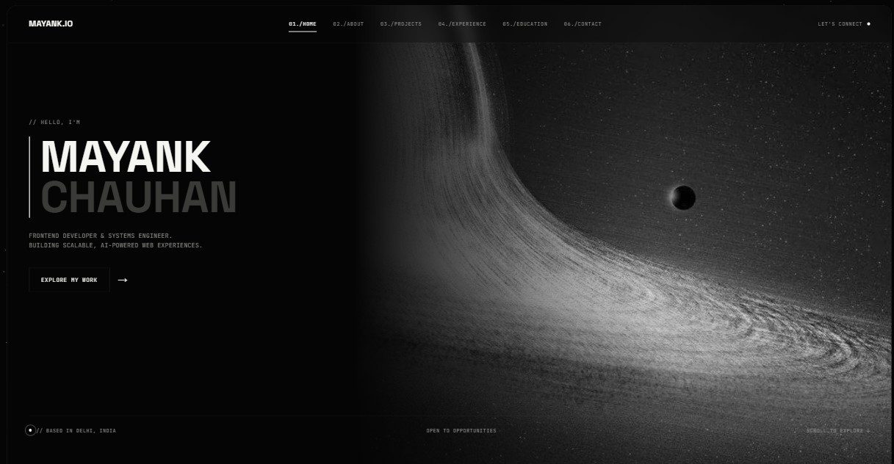
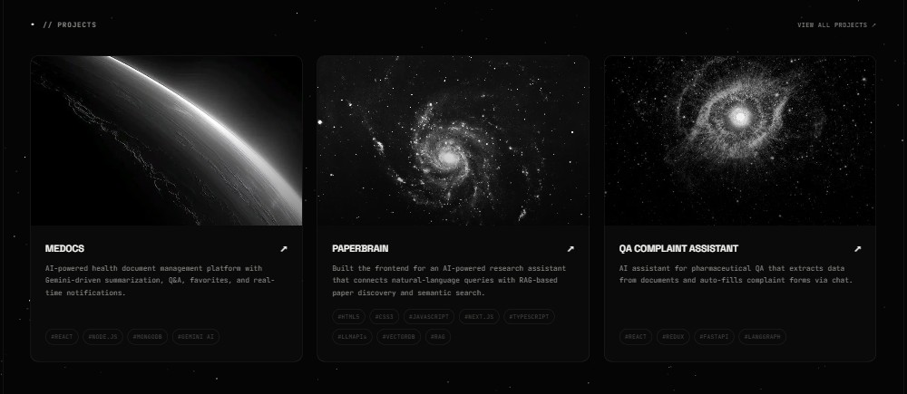
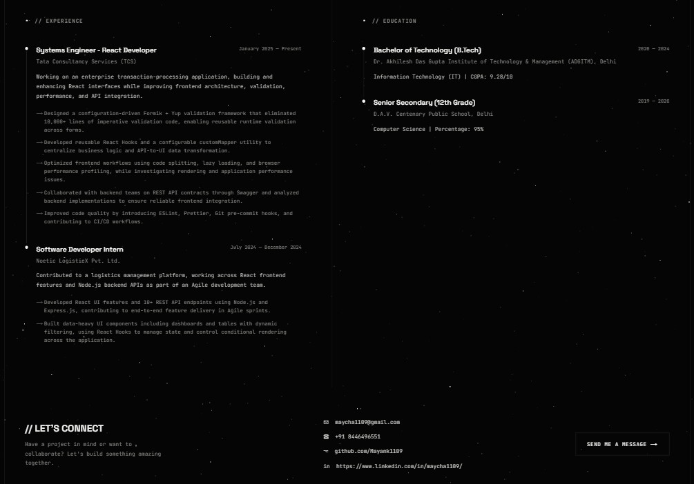

# Mayank Chauhan — Portfolio

A dark, black-hole-themed developer portfolio built with Next.js 14 (App Router) and TypeScript. Started as a pixel-match of a reference design, then extended into its own thing — cursor-reactive parallax hero, scroll-triggered reveals, a typewriter bio, and a twinkling starfield running behind the whole page.

## Live demo

**[https://mayank-portfolio-eosin.vercel.app/](https://mayank-portfolio-eosin.vercel.app/)** — replace with your actual deployment URL once you've shipped it ([see Deploying](#deploying)).

## Screenshots





## Overview

Single-page portfolio covering About, Projects, Skills, Experience/Education, and Contact — all data-driven from small arrays at the top of each component, so adding a project or a job doesn't mean touching JSX. The whole thing leans on one visual idea (a black hole hero image, monochrome palette, monospace/display type pairing) and carries it through consistently rather than treating the hero as a one-off banner.

## Features

- **Cursor-reactive hero parallax** — the hero background subtly shifts with mouse position (`HeroBackground.tsx`)
- **Scroll-triggered reveals** — sections fade/slide in via `IntersectionObserver` (`hooks/useReveal.ts`), with staggered entrance for project cards and skill columns
- **Typewriter bio** — the About paragraph types itself out, terminal-style, once scrolled into view (`Typewriter.tsx`)
- **Animated stat counters** — numbers count up from 0 on scroll (`AnimatedStat.tsx`)
- **Sliding nav indicator** — the active nav link's underline animates to position rather than snapping (`Header.tsx`)
- **Twinkling starfield + comets** — a fixed, low-opacity starfield with occasional comet streaks runs behind the entire page (`Starfield.tsx`)
- **Scroll progress bar** — thin fixed bar tracking page scroll position (`ScrollProgress.tsx`)
- **Lazy-loaded project images** — via `next/image`, so below-the-fold thumbnails don't block initial load
- **`prefers-reduced-motion` support** — parallax, typewriter, and scramble-text effects all check for and respect this OS-level setting
- **Fully responsive** — collapses to single-column on mobile with adjusted hero framing

## Tech stack

- **Framework:** Next.js 14 (App Router)
- **Language:** TypeScript
- **Styling:** Vanilla CSS with custom properties (no Tailwind/CSS-in-JS — see `app/globals.css`)
- **Fonts:** Space Grotesk + JetBrains Mono via `next/font/google`
- **Images:** `next/image` for lazy-loading and responsive `srcset`s

## Getting started

```bash
npm install
npm run dev
```

Open [http://localhost:3000](http://localhost:3000).

## Project structure

```
app/
  layout.tsx                # Root layout — fonts, metadata, mounts global effect layers
  page.tsx                   # Assembles all sections
  globals.css                 # All styling (design tokens as CSS custom properties)
  favicon.ico, icon.png,
  apple-icon.png               # Site icons (Next.js file-based icon convention)
components/
  Header.tsx                    # Glass nav with scroll-spy + sliding active-link indicator
  Hero.tsx                       # Hero section (headline, tagline, CTA)
  HeroBackground.tsx              # Cursor-parallax hero image layer
  ScrambleText.tsx                 # Decode/scramble text effect (hero headline)
  Typewriter.tsx                    # Terminal-style typing effect (About bio)
  AnimatedStat.tsx                   # Count-up number animation (About stats)
  About.tsx                           # About section + stats grid
  Projects.tsx                         # Project cards — edit the PROJECTS array to add/change
  Skills.tsx                            # Skills grid — edit SKILL_GROUPS to update
  ExperienceEducation.tsx                # Experience + education — edit EXPERIENCE/EDUCATION arrays
  Footer.tsx                              # Contact footer
  ScrollProgress.tsx                       # Fixed top scroll-progress bar
  Starfield.tsx                             # Twinkling starfield + comets, global background layer
hooks/
  useReveal.ts                               # IntersectionObserver hook powering scroll reveals
public/images/
  hero.jpg                                    # Hero background (black hole art)
  project-*.jpg                                # Project card thumbnails
docs/screenshots/                                # Drop README screenshots here
```

## Deploying

Standard Next.js app, deploys as-is to Vercel:

```bash
npm i -g vercel
vercel
```

Or build it yourself:

```bash
npm run build
npm start
```
